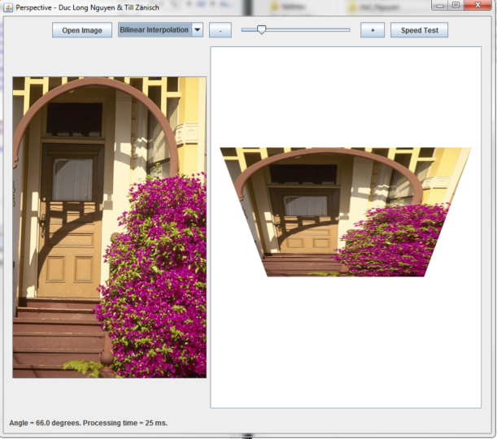

## Summary
This was an assignment for my "Image Processing" course. This little application changes the perspective of any given image 
giving the impression of it being rotated. Bicubic Interpolation is also applied to the result to deal with aliasing.

## Images 
